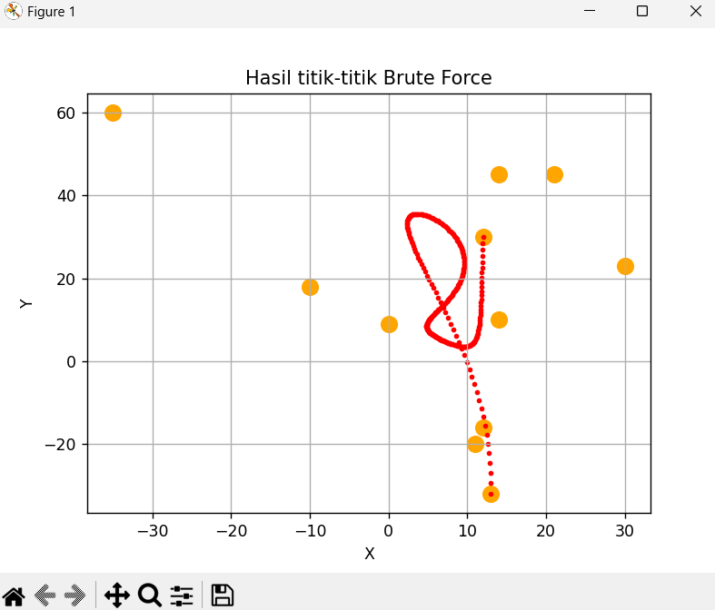
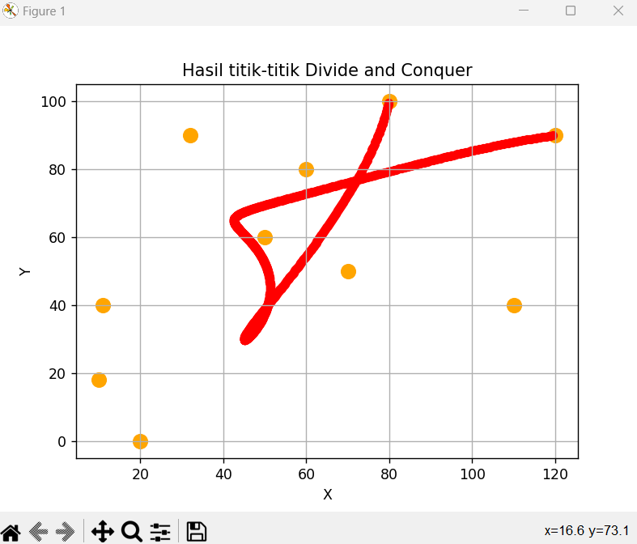

# Tugas Kecil 2 Strategi Algoritma 2023/2024
> Building Bézier Curve with Middle Point Algorithm based on Divide and Conquer.

## Table of Contents
* [General Info](#general-information)
* [Technologies Used](#technologies-used)
* [Features](#features)
* [Screenshots](#screenshots)
* [Setup](#setup)
* [Acknowledgements](#acknowledgements)


## General Information
The project aims to implement a Bézier Curve using the Middle Point Algorithm based on Divide and Conquer. It provides a solution for constructing Bézier curves efficiently.


## Technologies Used
- Python

## Features
- Visualize Bézier curve using Divide and Conquer algorithm
- Visualize Bézier curve using Brute Force algorithm


## Screenshots




## Setup
1. Clone the repository.
```
https://github.com/randyver/Tucil2_13522067_13522109.git
```
2. Navigate to the `src` folder and run
```
python main.py
```
If you want to see the animation of the curve formation, you can run
```
python bezier_animation.py
```


## Acknowledgements
This project was developed by:
- Randy Verdian (13522067)
- Azmi Mahmud Bazeid (13522109)

